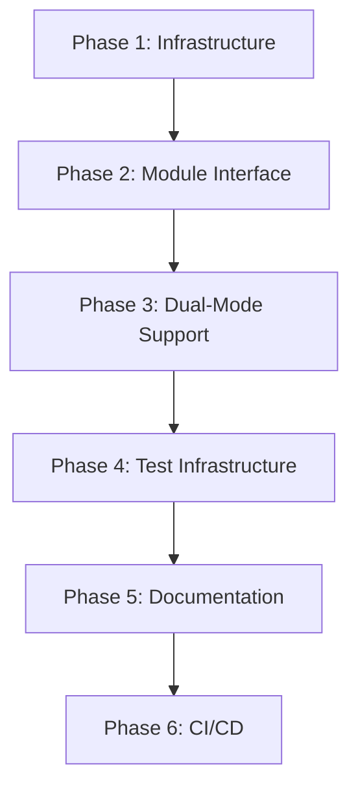

# C++ Modules Support Implementation Plan for Glaze

## Executive Summary
This plan outlines the steps to add C++20 modules support to the Glaze library while maintaining full backward compatibility with the traditional header-based include system. The implementation will be done in small, testable increments that can be submitted upstream individually.

## Prerequisites & Toolchain Requirements

### Current Status
- **Clang 18**: ✅ Sufficient (has full C++20 modules support)
- **GCC 14**: ⚠️ Needs update to GCC 15+ for reliable modules support
- **CMake**: Requires 3.28+ for proper C++20 modules support (3.30+ recommended)

### Recommended Toolchain
- **Clang**: 18+ (current is fine)
- **GCC**: 15+ (update recommended for modules)
- **CMake**: 3.30+ (for best modules support)

## Phase 1: Infrastructure Setup
*Goal: Prepare the build system for modules without breaking existing functionality*

### Step 1.1: Update CMake Requirements
**Work Unit**: Update CMake minimum version and add feature detection
- Update root `CMakeLists.txt` to require CMake 3.30+
- Add option `GLAZE_BUILD_MODULES` (default OFF initially)
- Add compiler feature detection for C++20 modules
- Create `cmake/modules/GlazeModulesSupport.cmake` helper file

**Testing**: Verify existing builds still work with new CMake version

### Step 1.2: Create Module Build Infrastructure
**Work Unit**: Add CMake module support functions
- Create module interface target `glaze_module` alongside existing `glaze_glaze`
- Add CMake functions for module compilation in `cmake/modules/`
- Configure module BMI (Built Module Interface) output directories

**Testing**: Ensure no impact on existing header-only builds

## Phase 2: Module Interface Creation
*Goal: Create the module interface files without changing headers*

### Step 2.1: Create Primary Module Interface
**Work Unit**: Create the main module interface file
- Create `module/glaze.cppm` as the primary module interface
- Export all public API namespaces and types
- Structure:
  ```cpp
  export module glaze;
  export import :core;
  export import :json;
  export import :binary;
  // ... other submodules
  ```

**Testing**: Compile module interface without linking to anything

### Step 2.2: Create Submodule Partitions
**Work Unit**: Create module partitions for major components
- `module/glaze.core.cppm` - Core types and utilities
- `module/glaze.json.cppm` - JSON serialization
- `module/glaze.binary.cppm` - Binary serialization
- `module/glaze.csv.cppm` - CSV support
- Map existing header structure to module partitions

**Testing**: Each partition compiles independently

### Step 2.3: Handle Template Instantiations
**Work Unit**: Manage template exports properly
- Identify all template classes/functions that need explicit export
- Add proper export declarations in module interfaces
- Handle constexpr and inline functions correctly

**Testing**: Create simple test program using modules

## Phase 3: Dual-Mode Support Implementation
*Goal: Support both headers and modules simultaneously*

### Step 3.1: Create Compatibility Layer
**Work Unit**: Build system for dual-mode compilation
- Modify CMake to build both header-only and module targets
- Create `glaze::glaze` (headers) and `glaze::module` (modules) targets
- Add preprocessor macro `GLAZE_USE_MODULES` for conditional compilation

**Testing**: Verify both modes compile the same test

### Step 3.2: Update Installation Rules
**Work Unit**: Package both headers and module interfaces
- Update CMake install rules to include `.cppm` files
- Create separate install components for modules
- Update `glazeConfig.cmake` to support module imports

**Testing**: Test installation and usage in external project

## Phase 4: Test Infrastructure
*Goal: Comprehensive testing for modules support*

### Step 4.1: Create Module-Specific Tests
**Work Unit**: Add dedicated module tests
- Create `tests/modules/` directory
- Add test targets:
  - `test_module_basic` - Basic module import and usage
  - `test_module_json` - JSON functionality via modules
  - `test_module_binary` - Binary serialization via modules
  - `test_module_interop` - Mix headers and modules

**Testing**: All new tests pass with modules enabled

### Step 4.2: Duplicate Key Tests for Modules
**Work Unit**: Run existing tests using modules
- Create module variants of critical existing tests
- Add CMake option to run all tests in module mode
- Ensure feature parity between header and module modes

**Testing**: Existing test suite passes in module mode

### Step 4.3: Performance Benchmarks
**Work Unit**: Compare compilation performance
- Add benchmark for compilation time (headers vs modules)
- Measure build time improvements with modules
- Document performance characteristics

**Testing**: Benchmarks run and produce metrics

## Phase 5: Documentation and Examples
*Goal: Help users adopt modules*

### Step 5.1: Update Documentation
**Work Unit**: Document module usage
- Add modules section to README
- Create `docs/modules.md` with detailed usage guide
- Update existing examples to show both approaches

**Testing**: Documentation builds correctly

### Step 5.2: Create Module Examples
**Work Unit**: Provide example projects
- Create `examples/modules/` directory
- Add examples:
  - Simple module import example
  - CMake integration example
  - Mixed header/module example

**Testing**: All examples compile and run

## Phase 6: CI/CD Integration
*Goal: Ensure modules work in CI*

### Step 6.1: Update CI Configuration
**Work Unit**: Add module builds to CI
- Add module build matrix to GitHub Actions
- Test with both Clang 18+ and GCC 15+
- Add module-specific test runs

**Testing**: CI passes with modules enabled

### Step 6.2: Conditional CI Based on Compiler
**Work Unit**: Handle compiler limitations gracefully
- Skip module tests on GCC 14 and older
- Add clear messages about compiler requirements
- Document minimum versions for modules

**Testing**: CI handles all compiler versions appropriately

## Implementation Order and Dependencies



## Risk Mitigation

1. **Compiler Compatibility**: Start with Clang-only support, add GCC when ready
2. **Build Complexity**: Keep header-only mode as default initially
3. **Performance Regression**: Benchmark continuously during implementation
4. **User Adoption**: Provide clear migration guides and maintain full backward compatibility

## Success Criteria

- [ ] All existing tests pass in both header and module modes
- [ ] Module compilation is faster than header compilation for large projects
- [ ] Zero breaking changes to existing header-only users
- [ ] Documentation clearly explains both usage modes
- [ ] CI validates both modes on every commit

## Timeline Estimate

- Phase 1: 1-2 days
- Phase 2: 2-3 days
- Phase 3: 2-3 days
- Phase 4: 3-4 days
- Phase 5: 1-2 days
- Phase 6: 1-2 days

**Total: 10-16 days of development**

## Notes for Implementers

1. Each step should result in a compilable, testable state
2. Create small, focused pull requests for each work unit
3. Run full test suite after each change
4. Keep module interfaces minimal initially, expand gradually
5. Document any compiler-specific workarounds needed
6. Consider using `std::source_location` for better error messages in modules

## Future Enhancements (Post-Initial Implementation)

- Module-based precompiled headers for even faster builds
- Submodule granularity for selective imports
- Module-aware code completion in IDEs
- Automated module dependency analysis tools